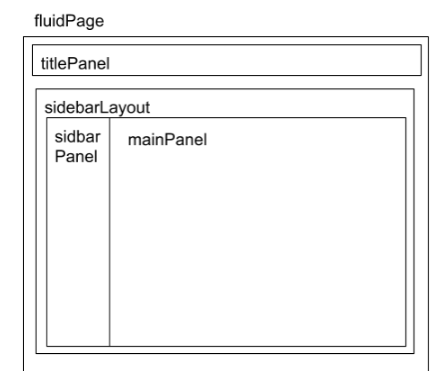
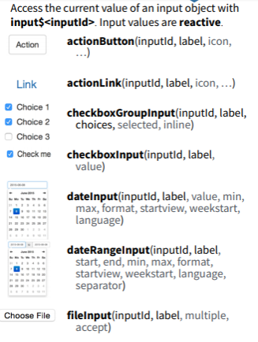
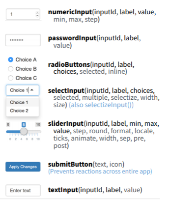
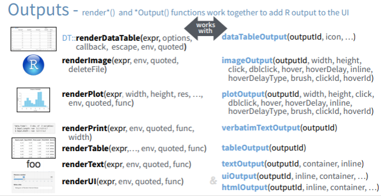
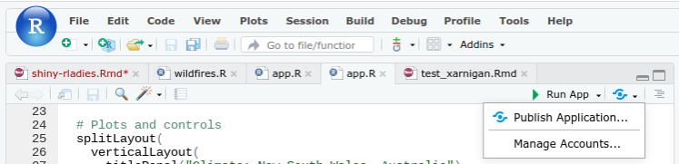
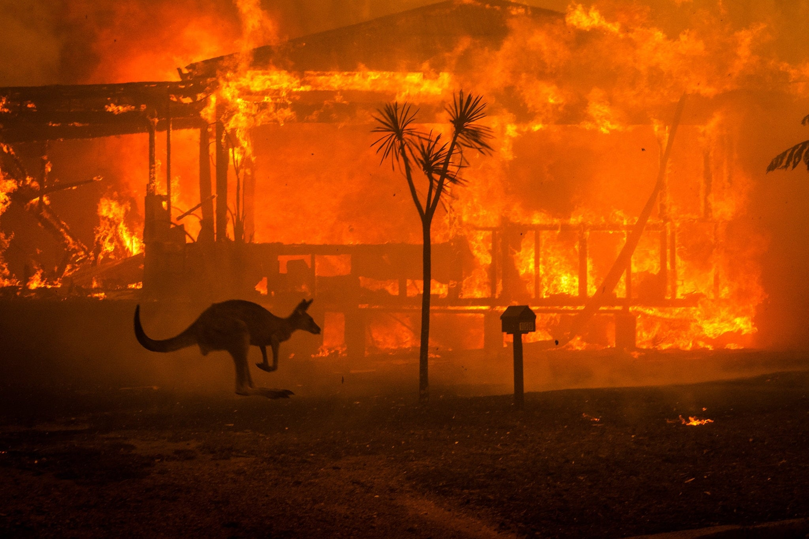

```{r setup, include=FALSE}
options(htmltools.dir.version = FALSE)
library(memer)
```


class: inverse, center, middle

# Introduction to Shiny
### Baltimore R-Ladies Meetup
### Amanda Peterson-Plunkett
### Twitter: @DrAmandaRP


```{r echo=FALSE, out.width = '25%'}
knitr::include_graphics("hex-shiny.png")
```

---
# What is Shiny?

An R package for building interactive web applications.

--

# Before Shiny:

```{r echo=FALSE, fig.align='center', out.width='80%'}
meme_get("OneDoesNotSimply") %>% 
  meme_text_bottom("One does not simply\nbuild a web app")
```

---
# Examples

Shiny:

* https://nsgrantham.shinyapps.io/tidytuesdayrocks/ 
* https://amandarp.shinyapps.io/TwitterLikes/

Shiny Dashboard:

* https://gqueiroz.shinyapps.io/rshinylady/

Also, see the winners of the Shiny Contest:

* https://blog.rstudio.com/2019/04/05/first-shiny-contest-winners/


```{r echo=FALSE, out.width = '30%', fig.align='center'}
knitr::include_graphics("shiny-contest.png")
```

---
# How to build a Shiny App: Three Major Components


```{example}

# Define the layout of the user interface
ui <- fluidPage()

# Define stuff that needs to be computed on the back end 
server <- function(input, output){}

# Run the application 
shinyApp(ui = ui, server = server)

```

```{r echo=FALSE, out.width = '50%', fig.align='center'}

```


---
# Let's look at a simple code example

1. In RStudio run `library(shiny)`
2. File -> New File -> Shiny Web App
3. Give it a name and choose the "Single File" option
4. Click "Run App"

```{r, eval = FALSE}
# Define UI for application that draws a histogram
ui <- fluidPage(  
   
   # Application title
   titlePanel("Old Faithful Geyser Data"),   
   
   # Sidebar with a slider input for number of bins 
   sidebarLayout(
      sidebarPanel(
         sliderInput("bins",
                     "Number of bins:",
                     min = 1,
                     max = 50,
                     value = 30)
      ),
      
      # Show a plot of the generated distribution
      mainPanel(
         plotOutput("distPlot")
      )
   )
)  

```

---
# The User Interface (UI) layout

.pull-left[

```{r, eval = FALSE}
# Define UI for application that draws a histogram
ui <- fluidPage(  
   
   # Application title
   titlePanel("Old Faithful Geyser Data"),   
   
   # Sidebar with a slider input for number of bins 
   sidebarLayout(
      sidebarPanel(
         sliderInput("bins",
                     "Number of bins:",
                     min = 1,
                     max = 50,
                     value = 30)
      ),
      
      # Show a plot of the generated distribution
      mainPanel(
         plotOutput("distPlot")
      )
   )
)  

```
]

.pull-right[


```{r echo=FALSE, out.width = '100%', fig.align='center'}

```


]


---
# The User Interface (UI)


```{r, eval = FALSE}
# Define UI for application that draws a histogram
ui <- fluidPage(  
   
   # Application title
   titlePanel("Old Faithful Geyser Data"),     
   
   # Sidebar with a slider input for number of bins 
   sidebarLayout(
      sidebarPanel(
         sliderInput("bins",  #<<
                     "Number of bins:",
                     min = 1,
                     max = 50,
                     value = 30)
      ),
      
      # Show a plot of the generated distribution
      mainPanel(
         plotOutput("distPlot")  #<<
      )
   )
)

```

We'll see `input$bins` and `output$distPlot` in the server function.

---
# The Server Function

```{r, eval = FALSE}
# Define server logic required to draw a histogram
server <- function(input, output) { 
   
   output$distPlot <- renderPlot({   #<<
      # generate bins based on input$bins from ui.R
      x    <- faithful[, 2] 
      bins <- seq(min(x), max(x), length.out = input$bins + 1)  #<<
      
      # draw the histogram with the specified number of bins
      hist(x, breaks = bins, col = 'darkgray', border = 'white')
   })
}  

# Run the application 
shinyApp(ui = ui, server = server)
```


---
# Remember!

`ui <- fluidPage(...)` is a *function call*. We add parameters to the `fluidPage` function. Need to use commas.

`server <- function(){...}` is a *function definition*. No commas.

```{r echo=FALSE, out.width = '50%', fig.align='center'}

```

---
# Inputs

<center>
.pull-left[
```{r echo=FALSE, out.width = '85%'}

```
]
.pull-right[
```{r echo=FALSE, out.width = '85%'}

```
]
</center>

<br>
<br>

<center>
Reference: shiny cheat sheet
</center>

---
# Outputs

<br>

```{r echo=FALSE, out.width = '85%', fig.align='center'}

```

<br>
<center>
Reference: shiny cheat sheet
</center>

---
# Where to host apps

### Deploy with a click of a button:

* RStudio Connect: Commercial
* shinyapps.io: Free and paid options   

```{r echo=FALSE, out.width = '85%', fig.align='center'}

```

<br>

### Open source solution:

* Shiny Server 


---
# Do I need shiny?

It depends. If you'd like to create a dashboard without user interaction, you might consider the **flexdashboard** package. 

### Pros (compared to Shiny):

1. Easier to learn-- just write an Rmd document and knit!

### Cons (compared to Shiny):

1. R not running in the background. No user interaction.
2. Requires re-knitting to update content

### More info:

* [Example](https://beta.rstudioconnect.com/jjallaire/htmlwidgets-ggplotly-geoms/htmlwidgets-ggplotly-geoms.html) of plotly graphs & flexdashboard
* See more information at [rmarkdown.rstudio.com/flexdashboard](rmarkdown.rstudio.com/flexdashboard)


---

# Shiny Resources

.pull-left[
* `#rshiny` on Twitter
* [Shiny Cheatsheet](http://shiny.rstudio.com/articles/cheatsheet.html)
* [Shiny Website](https://shiny.rstudio.com/)
* [Shiny Dashboard Website](https://rstudio.github.io/shinydashboard/)
* [Mastering Shiny](https://mastering-shiny.org/), by Hadley Wickham
]
.pull-right[
* [Building Big Shiny Apps](https://thinkr-open.github.io/building-shiny-apps-workflow/) by Colin Fay, Vincent Guyader, Cervan Girard, and Sébastien Rochette
* [Shiny in Production](https://kellobri.github.io/shiny-prod-book/index.html) by Kelly O'Brian
]

<br>
<center>
<blockquote class="twitter-tweet" data-lang="en"><p lang="en" dir="ltr">
You&#39;re doing it right if you get frustrated: if you&#39;re not frustrated, you&#39;re (probably) not stretching yourself mentally</p>&mdash; Hadley Whickham (@hadleywickham
) <a href="https://twitter.com/thomas_mock/status/565516733516349441">11 Feb 2015</a></blockquote>
</center>


---
class: center, middle, inverse
# Let's build an app!

<center>
<blockquote class="twitter-tweet" data-lang="en"><p lang="en" dir="ltr">The 
@R4DScommunity
 welcomes you to week 2 of #TidyTuesday! We&#39;re exploring the Australian fires - please use your best judgement when analyzing this ongoing issue, especially via maps!</p>&mdash; Thomas Mock (@thomas_mock
) <a href="https://twitter.com/thomas_mock/status/1214255918533292037">6. January 2020</a></blockquote>
</center>

---
# About the Data

* We're going to focus on the **New South Wales** in south east Australia
* **Fires**: Today's fire location data from NSW Rural Fire Service
* **Temperature** (degrees Celcius) data from the Australian Government Bureau of Meteorology
    - 1930 - 2018 (2019 was incomplete)
    - Computed yearly average 
* **Rainfall** data from the Australian Government Bureau of Meteorology
    - 1930 - 2018
    - Lots of missing data! Additionally, number of measurements varied by month.
    - Removed years that did not have atleast one measurement per month for all 12 months.
    - Computed monthly average and then rolled up to yearly average. 

--
# A sneak peak...

* Shiny app: [amandarp.shinyapps.io/AustralianWildfiresApp](https://amandarp.shinyapps.io/AustralianWildfiresApp)
* Shiny dashboard version: [amandarp.shinyapps.io/AustralianWildfiresDashboard](https://amandarp.shinyapps.io/AustralianWildfiresDashboard/)

---
# Instructions

The following packages need to be installed: `shiny`, `shinydashboard`, `shinythemes`, `tidyverse`, `gghighlight`, `lubridate`, `latex2exp`, `sf`, `mapview`

```{R eval=FALSE}
pkgs <- c( "shiny", "shinydashboard", "shinythemes", "tidyverse", "gghighlight", "lubridate", "latex2exp", "sf", "mapview" )
install.packages( pkgs )
```

2. Code available at [github.com/AmandaRP/RLadiesBmoreShinyWorkshop](github.com/AmandaRP/RLadiesBmoreShinyWorkshop) (you can fork this repo and pull into RStudio or just copy and paste the code into RStudio)
3. You'll need the `wildfires.R` script in this directory. (This script reads/cleans/summarizes the data.)
4. We'll start by looking at the `app.R` script in the `shinyApp` folder
    - Try running the app. (You'll notice that it's missing a few things.)
    - The rainfall plot (`rainPlot`) is defined in the server plot, but not showing in the UI. Add it to the UI below the temperature plot.
    - The year slider and city checkbox selection are not having an effect on the plots. Fix this in the server function.
    - Try different themes (line 17).
5. Next move to the `app.R` file located in the `shinyDashboard` folder
    - Try running the app. (You'll see it has missing components.)
    - Copy and paste components of the shiny app from #3 into this shiny dashboard app (search for "TODO" in the dashboard app code for hints).
    - Try other "skins". See line 21.


---
# Soundtrack

<center>
<iframe width="560" height="315" src="https://www.youtube.com/embed/l3Gux-Ly384" frameborder="0" allow="accelerometer; autoplay; encrypted-media; gyroscope; picture-in-picture" allowfullscreen></iframe>
</center>

---
# Thanks!

.pull-left[
* Data made available by Thomas Mock & @RForDataScienceCommunity 
* Wildfire polygon code provided by Dean Marchiori 
* Data sourced from the NSW Rural Fire Service and the Australian Government Bureau of Meteorology
* Slides created via the R package [**xaringan**](https://github.com/yihui/xaringan).

```{r echo=FALSE, out.width = '75%', fig.align='center', fig.cap='Photo: Matthew Abbot'}

```

]

.pull-right[
Packages used in making the app: 
* shiny
* shinydashboard
* shinythemes
* tidyverse
* ggplot2 
* gghighlight 
* magrittr 
* lubridate 
* latex2exp 
* sf 
* mapview

Best wishes to our mates in Australia! May the wildfires end soon!

]
